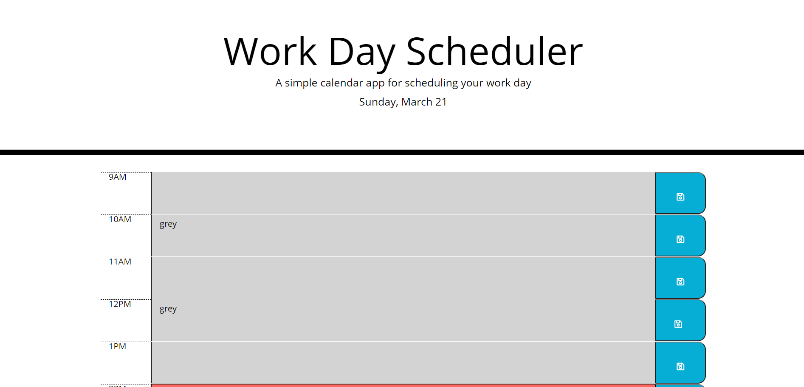

# daily-planner

## Purpose
A daily schedule manager for a standard work day (9-5) that users can fill out. The planner will display current day and update hourly and change each time block's appeance to reflect if that hour has passed(grey), is the current hour (red), and is a future hour (green).

## Made With
  * HTML
  * CSS
  * JAVASCRIPT
  * THIRD-PARTY API'S:
    * JQUERY
    * DAY.JS
    * BOOTSTRAP
    * Font Awesome
    * Google Fonts

## Url
https://carrington13.github.io/daily-planner/

## Screenshot

## Contributions
Starter index and stylesheet provided. 
* Style.js: Casey Arrington 
* Overhaul/additions to index.html: Casey Arrington